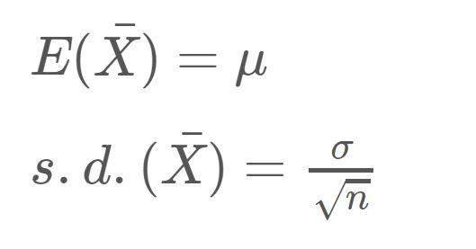
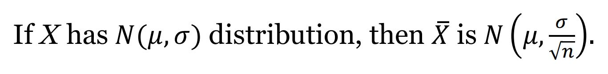
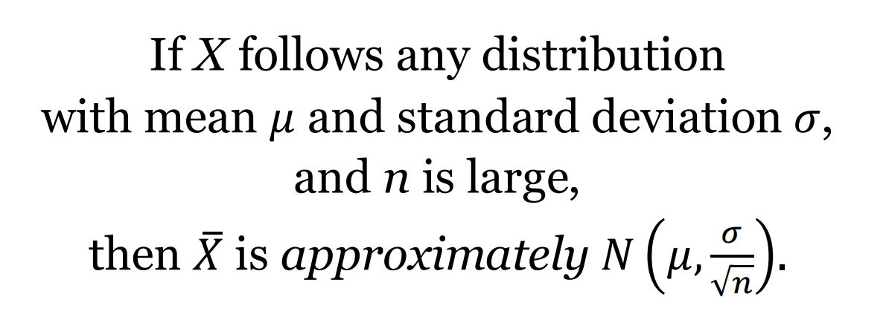
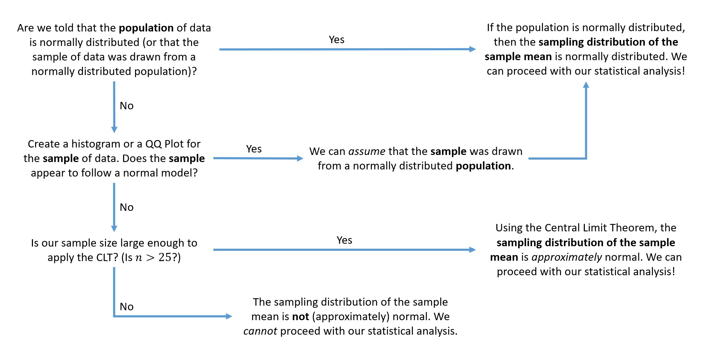

```{r setup, include = FALSE}
knitr::opts_chunk$set(echo = TRUE)
```


## Learning Objectives

### Statistical Learning Objectives
1. Checking for normality
1. Understand when to apply the Central Limit Theorem (CLT)
1. Estimate one population mean
1. Carry out a hypothesis test for one population mean

### R Learning Objectives
1. Create QQ plots 
1. Create confidence intervals for one population mean
1. Run hypothesis tests for one population mean

### Functions and Syntax
1. `qqnorm()`
1. `qqline()`
1. `t.test()`


***

## Lab Tutorial

### Sampling Distribution of Xbar

As we have seen many times this semester, the value of a statistic vary from sample to sample. Because the values of a statistic vary from sample to sample, we can create a sampling distribution for it. This allows us to see how all possible values of that statistic would fall for repeated samples of the same size. 

This week, our statistic is a sample mean (or Xbar) and our sampling distribution is the sampling distribution of the sample mean. We can quantify aspects of this sampling distribution, such as the center and spread. 

{width=200px}

We can use the above properties for **any** sample size! What can we say about the shape of this sampling distribution? Is it normal? Is it approximately normal? How can we tell? 

For the sampling distribution of the sample mean, we have the following property (straight from the formula card):

{width=450px}

If our population of data is normal, then the sampling distribution of the sample mean is also normal - *no matter what our sample size is*! 


### Checking for Normality 

If we don't have the entire population of data, how can we determine if the population of data is normal? We can use our *sample* of data and make assumptions about the population!

- If the sample appears to follow a normal model, then it is reasonable for us to assume that this sample was drawn from a normally distributed population.
- If the sample does not appear to follow a normal model, then it is not reasonable for us to assume that this sample was drawn from a normally distributed population. 

So how can we tell if our sample appears to follow a normal model? We can create a histogram for the variable of interest. But first, we need some data!


#### NHANES Data

In this lab, we will be using data from NHANES - the National Health and Nutrition Examination Survey. This is a program of studies designed to assess the health and nutritional status of adults and children in the United States. You can find more information about NHANES [here](https://www.cdc.gov/nchs/nhanes/about_nhanes.htm). 

NHANES is a very extensive data set, but we have filtered it down to a random sample of 82 participants and a set of ten variables, described below. 

- `height`: height (in cm)
- `weight`: weight (in kg)
- `BMI`: body mass index (in kg/m^2)
- `arm`: arm circumference (in cm)
- `chol`: cholesterol level (in mg)
- `iron`: iron level (in mg)
- `hgb`: hemoglobin (in g/dL)
- `caffeine`: caffeine amounts (in mg)
- `rbcc`: red blood cell count (in millions of cells/uL)
- `wbcc`: white blood cell count (in millions of cells/uL)

Let's read in the data using the code chunk below.

```{r readnhanes}
nhanes <- read.csv("nhanes_sample.csv")
```

And here's a quick preview of the data.

```{r previewnhanes}
head(nhanes)
```

Now that we have our data, let's create a histogram for the variable `height`. Remember, we should always include a good title and x-axis label for this plot.

```{r histReview}
hist(nhanes$height, 
     main = "Histogram of Heights \n for a Sample of 82 Participants",
     xlab = "Heights (in cm)")
```

**Question:** Does the sample of 82 heights appear to follow a normal model? 

**Answer:**

Now that we have made some observations about the distribution of the 82 responses, what can we conclude? What does this mean?

- **Conclusion about the sample:** Our *sample* of heights appears to follow a normal model (because the histogram is approximately bell-shaped)
- **Conclusion about the population the sample was drawn from:** Therefore, we can *assume* that this sample was drawn from a normally distributed *population* of heights
- **Conclusion about the sampling distribution of the sample means:** Therefore, we can assume that the sampling distribution of the sample mean is normal 
- **What do these observations imply about the inference procedure?** Therefore, we can proceed with creating a confidence interval or running a hypothesis test for the population mean height

That's a lot to digest, but it's very important to understand this logic flow. Now is a great time to ask questions!


#### QQ Plots

Another popular plot used to check for normality is a **QQ plot** (or quantile-quantile plot). This graph plots the quantiles of our data against the quantiles of a theoretical normal distribution. In order to conclude that our sample of data appears to follow a normal model, *we want to see our observations follow roughly along and around the straight line* (sometimes called the identity line) produced by the plot. Let's see what we're talking about.

To create a QQ plot, we need to utilize two functions, back-to-back. The first (`qqnorm()`) will create the plot of our observations, and the second (`qqline()`) will add the line to it. As always, we should add a title to the plot (but there is no need to change either of the axis labels).

```{r qqheights}
qqnorm(nhanes$height, main = "QQ Plot of Heights")
qqline(nhanes$height)
```

This is a fantastic QQ plot! The observations follow roughly along and around the line. There are no *major* deviations or *clear* patterns. 

**Notice:** The points do not line up *perfectly* on the line and that's okay! 

**We should not expect the data to line up perfectly. Instead, we want to make sure there aren't any major deviations or obvious patterns straying from the line**. These are *random* samples, so we should always expect to see some deviations or imperfections. 

So what are our conclusions from the QQ plot above?

- **Conclusion about the sample:** Our *sample* of heights appears to follow a normal model (because the points roughly follow along and around the line)
- **Conclusion about the population the sample was drawn from:** Therefore, we can *assume* that this sample was drawn from a normally distributed *population* of heights
- **Conclusion about the sampling distribution of the sample means:** Therefore, we can assume that the sampling distribution of the sample mean is normal 
- **What do these observations imply about the inference procedure?** Therefore, we can proceed with creating a confidence interval or running a hypothesis test for the population mean height

Okay, time to observe a "bad" QQ plot. Let's plot the cholesterol levels (`chol`) for the sample of 82 participants. 

```{r qqchol}
qqnorm(nhanes$chol, main = "QQ Plot of Cholesterol Levels")
qqline(nhanes$chol)
```

**Question:** From the QQ plot, can you conclude that the *sample* of cholesterol levels follows a normal model? 

**Answer:**

**Question:** Would you be able to *assume* that the *population* of cholesterol levels is normally distributed?

**Answer:** 


- We will talk about what this means for our analysis in the next section

Let's see what the histogram would have looked like for the cholesterol levels.

```{r histCholesterol}
hist(nhanes$chol, 
     main = "Histogram of Cholesterol Levels \n for a Sample of 82 Participants",
     xlab = "Cholesterol Levels (in mg)")
```

That doesn't look bell-shaped to me. Note: you will not need to know what QQ patterns correspond to a specific shape/skew in the histogram. Just know that we want the points to roughly follow along and around the line.


Okay, your turn!

**Demo #1:** Create a QQ plot of caffeine amounts (`caffeine`) for the sample of 82 participants. From your plot, can you conclude that the *sample* of caffeine amounts follows a normal model? Would you be able to *assume* that the *population* of caffeine amounts is normally distributed?

```{r demo1, error = T}
# Replace this text with your code

``` 

**Question:** From the QQ plot, can you conclude that the *sample* of caffeine amounts follows a normal model? 

**Answer:**

**Question:** What can you *assume* about the *population* of caffeine amounts?

**Answer:** 

**Demo #2:** Let's examine another QQ plot. Create a QQ plot of red blood cell counts (`rbcc`) for the sample of 82 participants. From your plot, can you conclude that the *sample* of red blood cell counts follows a normal model? Would you be able to *assume* that the *population* of red blood cell counts is normally distributed?

```{r demo2, error = T}
# Replace this text with your code

``` 

Discuss the plot as a class!

**Question:** What are our conclusions from the QQ plot of red blood cell counts?

**Conclusion about the sample:**

**Conclusion about the population the sample was drawn from:**

**Conclusion about the sampling distribution of the sample mean:**

**Question:** Can we proceed with the inference procedure to learn about the population mean red blood cell count?

**IMPORTANT NOTE: Sometimes these plots will be difficult to interpret - they are subjective and there can be quite a bit of gray area. Always be sure to justify your answer by describing what you see.**


### Central Limit Theorem

What if it isn't reasonable to assume our sample of data was drawn from a normally distributed population? (As we saw with the cholesterol levels and caffeine amounts above.)

We might be able to rely on the Central Limit Theorem to help us! The CLT states:

{width=400px}  

So what is large enough? We use the general rule of thumb that the sample size must be at least 25.

If our sample size is at least 25, then the *sampling distribution of the sample mean* will be *approximately* normal and we can proceed with our statistical analysis.

With the non-normal cholesterol and caffeine examples above, we would have the following logic flow:

- Our *sample* of data does *not* appear to follow a normal model (because the points stray away from the line with severe deviations)
- Therefore, we would *not* be able to conclude that the population of data is normally distributed
- *However*, because our sample size is large enough (n = 82), we can assume that the *sampling distribution of the sample mean is approximately normal* 
- Therefore, we can proceed with creating a confidence interval or running a hypothesis test for the population mean 

Imagine the Central Limit Theorem as a "band-aid". It doesn't magically make our population distribution normal (i.e. it doesn't "fix" our "broken" assumption). It does, however, "cover up" the failed assumption and allow us to keep moving forward with our analysis by concluding that the sampling distribution of the sample mean is approximately normal. 


### Road Map

This can certainly get confusing so we created a road map for checking the normality assumption.




### The t-Distribution

If we have determined that the sampling distribution of Xbar is either normal or approximately normal, we can proceed with our statistical analysis using the t-distribution.

The t-distribution is a symmetric, unimodal distribution that is centered at 0. It is very similar to the standard normal distribution, but has heavier (or wider) tails depending on the degrees of freedom. These wider tails will give us more conservative tail probabilities. 

This distribution is used when the true standard deviation (sigma) is unknown. Instead, we use the sample standard deviation (s) as an estimate of the population standard deviation to compute the *standard error* of xbar. Because we're using an estimate of the spread, we will utilize this slightly wider (more conservative) distribution for any statistical inference procedures.  


### Confidence Intervals

A confidence interval provides us with a range of reasonable values for an unknown parameter. Our new parameter of interest is now the population mean, mu. When we don't know the value of this parameter, we can estimate it using the sample mean, xbar. With this estimate, we add some margin of error (or "wiggle room" so to speak). The margin of error is calculated with the standard error of xbar and a t multiplier. We can find the t* multiplier using the T-Table on the formula card. The equation for the standard error of xbar is:

{width=180px}

Using these three components, we get the equation for our confidence interval:

{width=180px}

These components aren't too tricky to calculate individually (using `mean()`, `sd()`, and R as a calculator), but we can also use R and the built-in `t.test()` function. Let's use the NHANES data set to create a 90% confidence interval for the population mean height of NHANES participants. To do this, we need to specify two arguments: 

- the variable of interest (`dataset$variable`)
- the confidence level (`conf.level`)

Let's see an example:

```{r CIoneMean}
t.test(nhanes$height, conf.level = 0.90)
```

Right away, the output seems strange because we get a test statistic and a p-value. **Ignore this.** We are only concerned with the second half of the output. 

The 90% confidence interval is (165.5342 cm, 169.2487 cm). 

**Question:** Provide an interpretation of the 90% confidence interval.

**Answer:**

**Demo #3:** Create the 99% confidence interval for the population mean cholesterol level for the NHANES participants.

```{r demo3, error = T}
# Replace this text with your code

```

**Question:** What is the point estimate for the population mean cholesterol level for the NHANES participants? 

**Answer:**


### Hypothesis Testing

A hypothesis test helps us judge whether or not a statement about a population is reasonable or not. The procedure for running any hypothesis test involves three steps:

1. Stating two competing hypotheses about an unknown parameter
2. Analyzing the evidence collected from sample data
3. Making a decision about whether or not the sample data supports the new theory

Our parameter of interest is now the population mean, mu. When setting up the hypotheses, we have three options.

{width=340px}

Suppose it is currently believed that individuals have 4.5 million red blood cells per microliter (uL), on average. A medical researcher, however, believes that the true mean red blood cell count is actually *greater* than this value. We could use our NHANES data to test the following hypotheses:

{width=340px}

To run this hypothesis test, we use the `t.test()` function and have three arguments to specify:

- variable of interest (`dataset$variable`)
- `mu`: hypothesized value of mu
- `alternative`: alternative hypothesis ("less", "greater", or "two.sided")

Our code would look like this:

```{r HToneMean}
t.test(nhanes$rbcc,
       mu = 4.5,
       alternative = "greater")
```

The output seems strange because we get output for a confidence interval. **Ignore this.** We are only concerned with the first half of the output. The first half of this output tells us:

- the observed t-test statistic (3.1778)
- the degrees of freedom for the t-distribution (81)
- the corresponding p-value (0.001051)

**Question** Evaluate the p-value. 

**Answer:** 


**Demo #4:** Suppose an old report claimed that the population mean caffeine amount was 150 milligrams and we wish to determine if this value has *changed*. 

```{r demo4, error = T}
# Replace this text with your code

```

**Question:** Given the NHANES data, how much evidence do we have against the null (and in support of the alternative). What would our conclusions be?

**Answer:**

***


## Try It!

Complete the following exercises. Remember, the "Try It" questions will typically be code-based and will be graded for **completeness**. Be sure to give *every* question your best shot! We strongly encourage you to form small groups and work together.

In this Try It, we will create a confidence interval and run a hypothesis test surrounding the typing speed and accuracy for a random sample of 41 students in Stats 250. The variables included in our data set are:

- `origSpeed`: typing speed *with* errors (in words per minute or wpm)
- `accuracy`: percentage of words typed correctly
- `netSpeed`: net typing speed *without* errors (in words per minute or wpm)

If you're interested in your own typing abilities, you can take a one-minute test [here](https://www.typingtest.com/). Select "Medium Text". 

> **1.** Start by reading in the data.

```{r readTypingSpeeds}
typing <- read.csv("typingSpeeds.csv")
```


We will start by creating a confidence interval for the population mean **original** typing speed. Be sure to use the correct variable. 

> **2.** Use the `qqnorm()` and `qqline()` functions to create a QQ plot for the sample of **original** typing speeds (`origSpeeds`). Is it reasonable to assume that this sample of original typing speeds was drawn from a normally distributed population?

```{r tryIt2, error = T}
# Replace this text with your code

```

**Answer:** Replace this text with your answer.


> **3.** Use the `mean()` and `sd()` functions to compute the sample mean and sample standard deviation for the sample of 41 original typing speeds.  

```{r tryIt3, error = T}
# Replace this text with your code

```


> **4.** Use R as a calculator (or use your own calculator) to compute the *standard error* for the sampling distribution of the sample mean -- s.e.(x_bar). Reference your formula card if you forgot how to calculate this!

```{r tryIt4, error = T}
# Replace this text with your code

```

**Answer:** Replace this text with the value of the standard error. 


> **5.** Use the T-Table in your formula card to find the value of the t* multiplier for a 90% confidence interval. Remember, this multiplier depends on sample size.    

**Answer:** Replace this text with your t* multiplier.


> **6.** Use the `t.test()` function to create the 90% confidence interval for the population mean original typing speed (in wpm) for all Stats 250 students. You are welcome to confirm that this interval is correct by calculating the interval (by hand) using the values you calculated in Try It 3, 4, and 5.  

```{r tryIt6, error = T}
# Replace this text with your code

```


We will now run a hypothesis test for the population mean **net** typing speed. Be sure to use the correct variable. 

> **7.** Use the `qqnorm()` and `qqline()` functions to create a QQ plot for the sample of **net** typing speeds (`netSpeeds`). Is it reasonable to assume that this sample of net typing speeds was drawn from a normally distributed population? 

```{r tryIt7, error = T}
# Replace this text with your code

```

**Answer:** Replace this text with your answer.


> **8.** The website labels a "fast" typer as someone who has a **net** typing speed of 65 words per minute. We would like to determine if the average **net** typing speed for all Stats 250 students is *above* this value. Use the `t.test()` function to run this hypothesis test. Evaluate your p-value below - how strong is your evidence against the null hypothesis and in favor of the alternative (not enough, some, strong, or very strong)?

```{r tryIt8, error = T}
# Replace this text with your code

```

**Answer:** Replace this text with your evaluation


***


## Dive Deeper

Complete the following questions. Remember, the "Dive Deeper" questions will involve analyzing the results and will be graded for **correctness**. If you have any questions, please ask for help (in lab, in office hours, or on Piazza)!

> **1.** Is the following statement appropriate? *"If the population mean net typing speed for Stats 250 students was 65 wpm, and we took repeated random samples of 41 Stats 250 students and recorded the sample mean net typing speed for each sample, we would expect to observe a sample mean of 74.4878 wpm or greater in about 0.001194% of the samples."* Explain why or why not.

**Answer:** Replace this text with your answer.


> **2.** If we had analyzed, the typing accuracy (`accuracy`) we would have observed the QQ Plot below. The plot looks a little strange because a lot of students had the same accuracy (we see a horizontal line of 11 points for 11 students that all had a 92% accuracy, another horizontal line of 7 points for 7 students that all had 93% accuracy, etc.). From this plot, you may make the conclusion that the sample does *not* follow a normal model. However, we have a large enough sample size to utilize the Central Limit Theorem. When we rely on the CLT, what is approximately normal if the sample size is large enough? Is it the population of data, the population mean, the sample of data, the observed sample mean, or the sampling distribution of the sample mean? 

```{r qqplotAccuracy}
qqnorm(typing$accuracy, main = "QQ Plot of Typing Accuracy")
qqline(typing$accuracy)
```

**Answer:** Replace this text with your answer.


***


## Submission Instructions

Carefully follow the instructions below to submit your work.

1. At the top of this document, change the `author` field to your name (in quotes!). 

2. Click the **Knit** button one last time.

3.  In the Files pane (the bottom right window), check the box next to "lab06report.html".

4. Click More > Export... 

5. Leave the name of the file as "lab06report.html". **Do not change the file name.** Click Download and save the file to your computer.  

6.  On the Stats 250 Canvas site, click the "Assignments" panel on the left side of the page. Scroll to find "Lab 6", and open the assignment. Click "Start Assignment". 

7.  At the bottom of the page, upload your saved "lab06report.html" file. 

8.  Click "Submit Assignment". 


